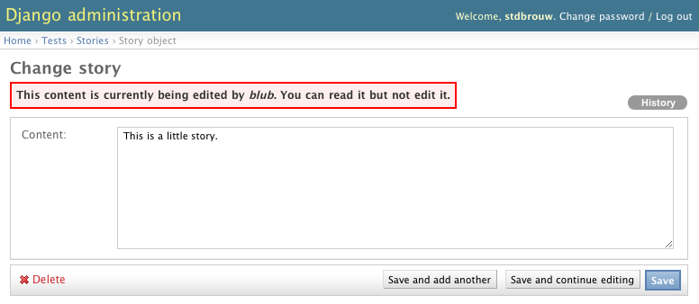

Concurrency control with django-locking
=======================================

You should take a look at this page first, as it'll answer most of your questions, but here's the TOC to the entire documentation: 

.. toctree::
   :glob:
   
   *
   
Read more about this project at :doc:`credits`.

Avoiding concurrent edits
-------------------------

Django has seen great adoption in the content management sphere, especially among the newspaper crowd. One of the trickier things to get right, is to make sure that nobody steps on each others toes while editing and modifying existing content. Newspaper editors might not always be aware of what other editors are up to, and this goes double for distributed teams. When different people work on the same content, the one who saves last will win the day, while the other edits are overwritten. ``django-locking`` **provides a system that makes concurrent editing impossible, and informs users of what other users are working on and for how long that content will remain locked. Users can still read locked content, but cannot modify or save it.**

.. image:: screenshots/locked-list.png

``django-locking`` **interfaces with the django admin** application, but **also provides an API** that you can use in applications of your own.

Looking for something else?
'''''''''''''''''''''''''''

Do note that, in the context of this application, 'locking' means preventing concurrent editing. You might also know this by the term 'mutex' or the more colloquial 'checkouts'. If you ended up here while looking for an application that provides permission-based access to certain content, read up on *row-level permissions* and *granular permissions*. Also check out django-lock__, django-granular-permissions__ and similar apps.

.. __: http://code.google.com/p/django-lock/

.. __: http://github.com/f4nt/django-granular-permissions

Beta-quality
''''''''''''

While ``django-locking`` has seen a little production use and has a fair amount of unit-tests, please be advised that at this moment it is still beta-quality software. However, I'm quite responsive when it comes to the `GitHub issue tracker`__, and you should also feel free to contact me more directly, either `through GitHub or by e-mailing`__.

.. __: http://github.com/stdbrouw/django-locking/issues

.. __: http://github.com/stdbrouw

Features
--------

* admin integration
* django-locking tells you right from the start if content is locked, rather than when you try to save and override somebody else's content
* lock expiration: leaving a browser window open doesn't lock up content indefinitely
* other users can still view locked content, they just can't edit the stuff somebody else is working on
* configurable: you can define the amount of minutes before the app auto-expires content locks
* users receive an alert when a lock is about to expire
* A public API for coders who want to integrate their apps with ``django-locking``. See :doc:`developers` and :doc:`api`.
* well-documented

Soon: 

* currently only supports soft locks (javascript), but soon it'll do hard locks as well (see :doc:`design`)
* manual lock overrides for admins
* some other things (see :doc:`ponies`)

.. django-locking is carefully unit-tested (X% code coverage with over Y tests that span more than Z lines of code). Developers expanding on the code or debugging will appreciate that most of its functionality is log-enabled, so you can see what's going on behind the screen.

.. Additionally, it has a public API, is carefully unit-tested and is log-enabled so you can see what's going on behind the screen.

Installation
------------

1. Downloading and installing the app and its dependencies (django-staticfiles, simplejson)
2. adding the app to settings.py, and optionally specifying a LOCK_TIMEOUT
3. configure ``django-staticfiles file serving`` for development (see the documentation here__)
4. Adding locking to your models, updating the database models 
5. Activating locking in the admin.
6. Using the locking API
7. Using django-locking in production (django-staticfiles)

.. __: http://bitbucket.org/jezdez/django-staticfiles/src#serving-static-files-during-development

Usage
-----

Once you've installed ``django-locking`` and have one or a few models that have ``LockableModel`` as a base class, you're set to go.

Below are a few guidelines for advanced usage.

* By default, ``django-locking`` uses **soft locks**. Read more about different methods of locking over at :doc:`design`.
* When integrating with your own applications, you should take care when overriding certain methods, specifically ``LockableModel.save`` and ``LockableAdmin.changelist_view``. Make sure to call ``super`` if you want to maintain the default behavior of ``django-locking``.

Learn more about best practices when using super here__. Chiefly, do not assume that subclasses won't need or superclasses won't pass any extra arguments. You will want your overrides to look like this: 

.. __: http://fuhm.net/super-harmful/

::

    def save(*vargs, **kwargs):
        super(self.__class__, self).save(*vargs, **kwargs)